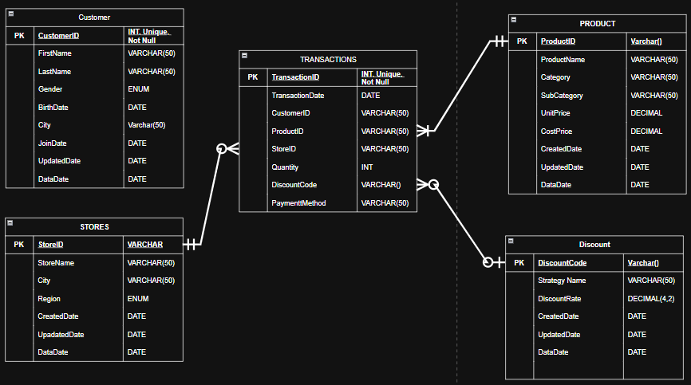
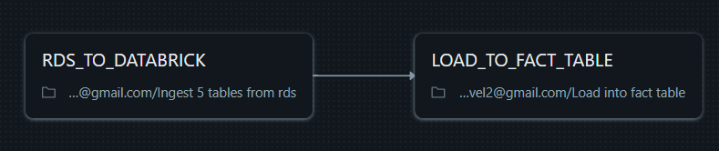

# On-job training task at Fsoft-AIC
Duration: 16/10/2025 - 10/11/2025

Weekly report: https://docs.google.com/spreadsheets/d/1zdDktxglNR0wwIMsawnEVWvfq09ic84ynWjtMIPZMww/edit?gid=0#gid=0

The purpose of this project is designing a data pipeline to load data from a data sources into databrick delta tables using multiples loading strategies.

Dataset: https://www.kaggle.com/datasets/buharishehu/retail-sales-dataset

ERD design: 

  

Pipeline:

  

